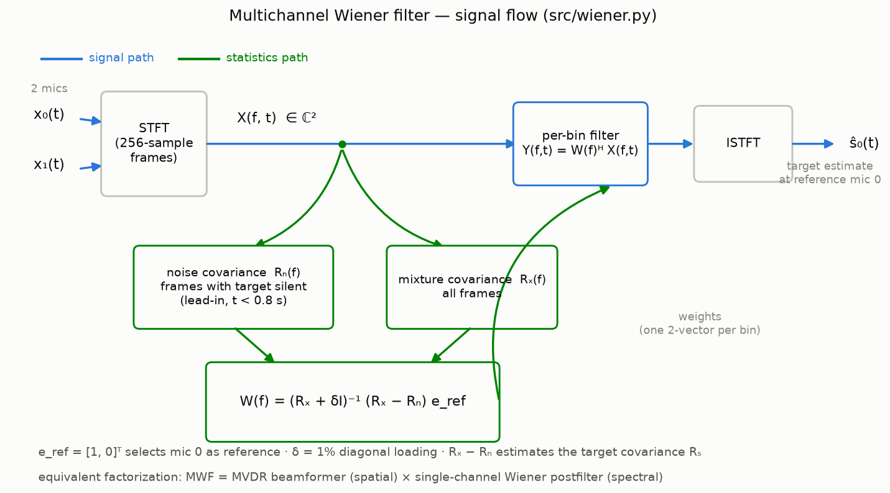
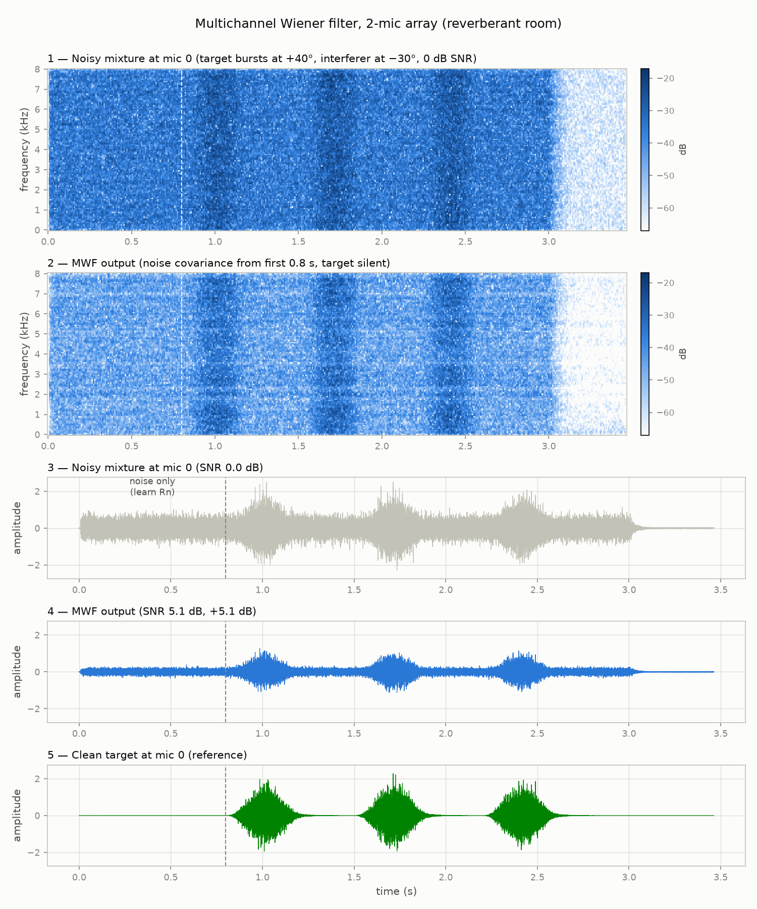

# Sound Localization System

Estimate the direction of an acoustic event with two microphones. Three
independent DOA methods — **GCC-PHAT → TDOA → angle**, a **delay-and-sum
beamformer**, and an **MVDR (Capon) beamformer** — verified against
pyroomacoustics room simulations (no microphone hardware required).

**Results snapshot** (±80° sweep, GCC-PHAT): mean error 0.20° anechoic,
0.57° in a reverberant room (RT60 = 0.3 s, 15 dB SNR). All three methods
agree at the +40° test case. Details in [summary.md](summary.md).


## Pipeline

1. **GCC-PHAT** — generalized cross-correlation with phase transform between
   the two mic signals ([src/gcc_phat.py](src/gcc_phat.py)). The phase
   transform whitens the spectrum, making the correlation peak robust to
   reverberation.
2. **TDOA** — the correlation peak location gives the time difference of
   arrival, with 16× interpolation for sub-sample precision.
3. **Angle** — far-field conversion `θ = arcsin(c·τ / d)`, where `d` is the
   mic spacing and `c` the speed of sound. Range ±90° from broadside
   (a 2-mic array cannot resolve front/back).

## GCC-PHAT in brief

**GCC-PHAT = Generalized Cross-Correlation with PHAse Transform** (Knapp &
Carter, 1976). A time delay between two signals lives in the *phase* of their
cross-power spectrum: `R(f) = X₀(f)·X₁*(f) = |S(f)|²·e^(−j2πfτ)`. GCC-PHAT

1. computes `R(f)` via FFT,
2. **whitens it** — `R/|R|` — discarding magnitude so every frequency votes
   equally and only the phase slope `e^(−j2πfτ)` remains,
3. inverse-FFTs back: a pure phase slope transforms to a sharp peak at lag τ.

The whitening step is what makes it robust to reverberation (reflections
corrupt magnitude more than the direct path's phase slope) and is the entire
difference from plain cross-correlation. Our implementation
([src/gcc_phat.py](src/gcc_phat.py)) adds 16× band-limited interpolation of
the correlation for sub-sample delay resolution (3.9 µs ≈ 0.5° near
broadside) and restricts the peak search to physically possible lags
±d/c = ±437 µs.

### Experiment

Single-source test at +40° (anechoic, white noise): the measured correlation
peak lands at τ = 281.2 µs vs 281.1 µs geometric truth, giving
θ = arcsin(c·τ/d) = +40.03°. The walkthrough figure below shows the raw mic
signals (mic 1 leads by 281 µs), the whitened correlation with its single
sharp peak, and the angle conversion. The full ±80° sweep (17 angles × 2
scenarios, `src/run_sim.py`) yields mean error 0.20° anechoic / 0.57°
reverberant.

## Setup

```bash
python3 -m venv .venv
source .venv/bin/activate
pip install numpy scipy pyroomacoustics matplotlib
```

## Run the simulation verification

```bash
.venv/bin/python src/run_sim.py
```

Simulates a 0.5 s noise burst at angles −80°…+80° (10° steps, source 2 m from
a 0.15 m 2-mic array, fs = 16 kHz) in two scenarios: anechoic, and a
reverberant room (RT60 = 0.3 s) with 15 dB SNR sensor noise.

Outputs:
- `results/sim_results.csv` — per-angle true/estimated/error
- `plots/angle_sweep.png` — estimated-vs-true and error curves


To visualize the simulation setup (room, mic array, source arc):

```bash
.venv/bin/python src/plot_geometry.py   # -> plots/room_geometry.png
```

To see the pipeline step by step for a single +40° source (mic waveforms,
GCC-PHAT peak, arcsin conversion):

```bash
.venv/bin/python src/plot_pipeline.py   # -> plots/pipeline_plus40.png
```


## Delay-and-sum beamformer (alternative DOA method)

`src/beamformer.py` implements a delay-and-sum beamformer: for each candidate
steering angle, one channel is fractionally delayed (FFT phase shift), the
channels are summed, and the steering angle with maximum output power is the
DOA estimate — a steered-response-power scan instead of a correlation peak.

```bash
.venv/bin/python src/plot_beamformer.py   # -> plots/beamformer_plus40.png
```

## MVDR / Capon beamformer

`src/mvdr.py` implements a broadband MVDR spatial spectrum: STFT both
channels, estimate a 2×2 spatial covariance per frequency bin (with diagonal
loading), and average the Capon pseudo-spectrum `1 / (aᴴ R⁻¹ a)` over the
300–7000 Hz band. MVDR minimizes output power subject to unit gain toward the
look direction, giving a much sharper peak than delay-and-sum.

```bash
.venv/bin/python src/plot_mvdr.py   # -> plots/mvdr_plus40.png
```


Stage-by-stage walkthrough of the MVDR algorithm (STFT → per-bin covariance
→ narrowband Capon spectra → band average → angle):

```bash
.venv/bin/python src/plot_mvdr_pipeline.py   # -> plots/mvdr_pipeline_plus40.png
```


## Multichannel Wiener filter (target enhancement)

`src/wiener.py` implements a per-bin multichannel Wiener filter
`W = (Rx + δI)⁻¹ (Rx − Rn) e_ref`: the noise spatial covariance `Rn` is
learned from a target-silent lead-in, the mixture covariance `Rx` from the
whole capture, and the filter estimates the target signal at the reference
mic with minimum mean squared error (equivalently, MVDR beamforming plus a
single-channel Wiener postfilter). Unlike the DOA methods above, this block
*enhances* the target rather than locating it.



(Diagram generated by `src/plot_mwf_diagram.py`.)

Experiment (`src/run_wiener.py`): target noise bursts at +40°, continuous
white-noise interferer at −30°, reverberant room, 0 dB input SNR at mic 0.
The MWF improves SNR by **+5.1 dB** with two mics.

```bash
.venv/bin/python src/run_wiener.py   # -> plots/mwf_demo.png
```



See [summary.md](summary.md) for current results.

## Beamforming experiments (PySDR walkthrough)

What to do *after* the DOA is known: conventional vs MVDR vs LCMV weights,
nulling interferers, extracting several sources at once, and polar
beampatterns of the 2-mic array. Scripts `src/pysdr_*.py` follow the
[PySDR DOA chapter](https://pysdr.org/content/doa.html); write-up with all
plots in [beamforming_experiments.md](beamforming_experiments.md).

## Polar beampatterns (delay-and-sum vs MVDR)

`src/plot_polar.py` draws the array's directional response in the classic
polar form — the plot you see in mic-array tutorials — for the 2-mic,
15 cm geometry steered to +40°.

- **Left, delay-and-sum** at 500 Hz–4 kHz: the beam narrows with frequency,
  grating lobes appear above the spatial-aliasing limit `c / (2d) ≈ 1143 Hz`,
  and every pattern is mirror-symmetric about the mic axis (±90°) — the
  front/back ambiguity of any linear array.
- **Right, MVDR** steered to +40° with an interferer at −30°: the weights
  `w = Rₙ⁻¹a / (aᴴRₙ⁻¹a)` keep unit gain at the look direction and place a
  null on the interferer. With two mics there is exactly one null to spend;
  the DOA estimate is what tells you where to spend it. At frequencies where
  the two directions alias onto the same steering vector (e.g. 2 kHz for this
  pair of angles) no null is possible — another reason to keep `d < λ/2`.

```bash
.venv/bin/python src/plot_polar.py   # -> plots/polar_patterns.png
```


## Layout

- `src/` — DOA methods (`gcc_phat.py`, `beamformer.py`, `mvdr.py`),
  enhancement (`wiener.py`), simulation harness (`run_sim.py`), plot
  scripts (`plot_*.py`, incl. `plot_polar.py` beampatterns)
- `plots/` — generated figures (checked in, embedded above)
- `results/`, `data/`, `logs/` — generated artifacts (not checked in)

## Next steps

- Live demo: needs a 2-channel USB input device (e.g. stereo interface or
  ReSpeaker USB mic array) — the built-in MacBook mic exposes only 1 channel.
- Event classifier (guide steps 3–4): compact neural net on top of the same
  frames, combining event identity with direction.
