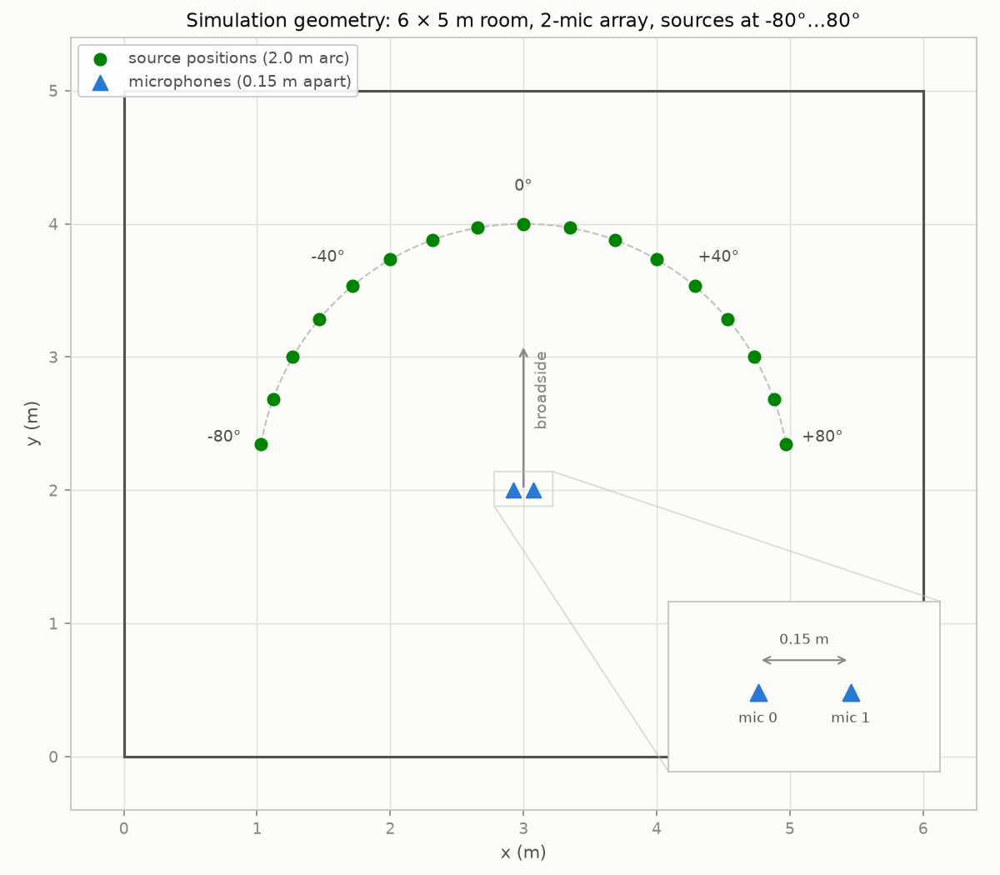
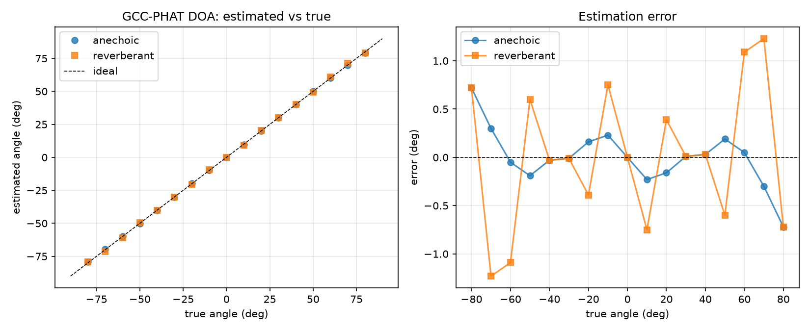
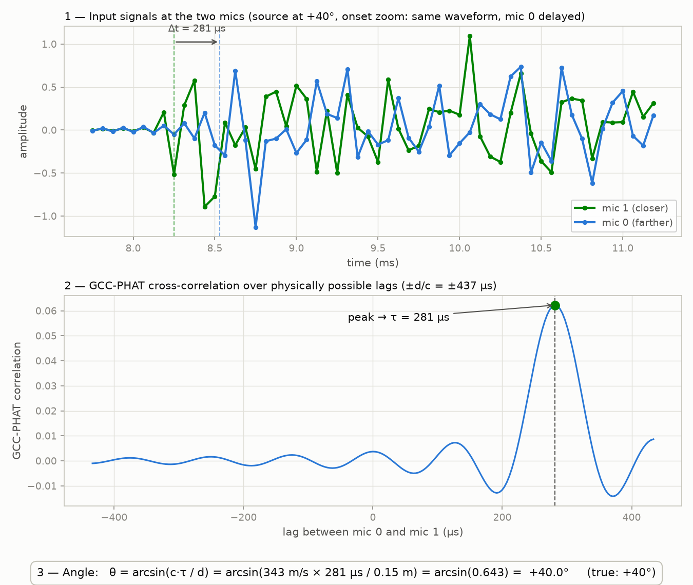
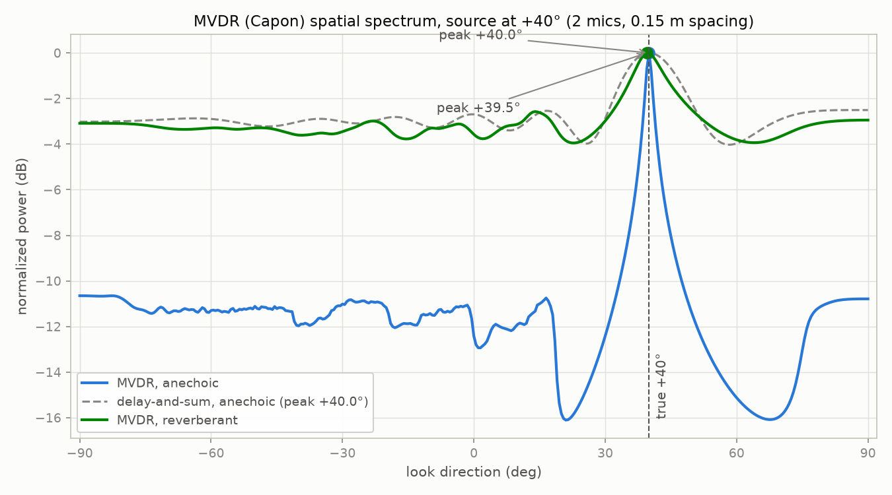
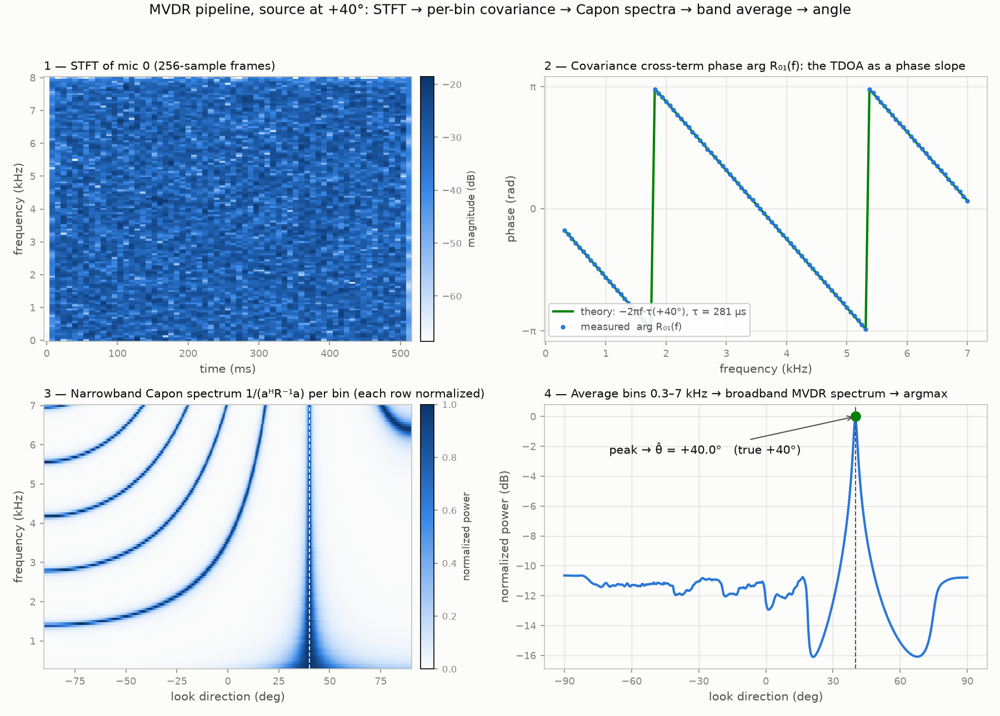

# Sound Localization System

Estimate the direction of an acoustic event with two microphones. Three
independent DOA methods — **GCC-PHAT → TDOA → angle**, a **delay-and-sum
beamformer**, and an **MVDR (Capon) beamformer** — verified against
pyroomacoustics room simulations (no microphone hardware required).

**Results snapshot** (±80° sweep, GCC-PHAT): mean error 0.20° anechoic,
0.57° in a reverberant room (RT60 = 0.3 s, 15 dB SNR). All three methods
agree at the +40° test case. Details in [summary.md](summary.md).



## Pipeline

1. **GCC-PHAT** — generalized cross-correlation with phase transform between
   the two mic signals ([src/gcc_phat.py](src/gcc_phat.py)). The phase
   transform whitens the spectrum, making the correlation peak robust to
   reverberation.
2. **TDOA** — the correlation peak location gives the time difference of
   arrival, with 16× interpolation for sub-sample precision.
3. **Angle** — far-field conversion `θ = arcsin(c·τ / d)`, where `d` is the
   mic spacing and `c` the speed of sound. Range ±90° from broadside
   (a 2-mic array cannot resolve front/back).

## Setup

```bash
python3 -m venv .venv
source .venv/bin/activate
pip install numpy scipy pyroomacoustics matplotlib
```

## Run the simulation verification

```bash
.venv/bin/python src/run_sim.py
```

Simulates a 0.5 s noise burst at angles −80°…+80° (10° steps, source 2 m from
a 0.15 m 2-mic array, fs = 16 kHz) in two scenarios: anechoic, and a
reverberant room (RT60 = 0.3 s) with 15 dB SNR sensor noise.

Outputs:
- `results/sim_results.csv` — per-angle true/estimated/error
- `plots/angle_sweep.png` — estimated-vs-true and error curves



To visualize the simulation setup (room, mic array, source arc):

```bash
.venv/bin/python src/plot_geometry.py   # -> plots/room_geometry.png
```

To see the pipeline step by step for a single +40° source (mic waveforms,
GCC-PHAT peak, arcsin conversion):

```bash
.venv/bin/python src/plot_pipeline.py   # -> plots/pipeline_plus40.png
```



## Delay-and-sum beamformer (alternative DOA method)

`src/beamformer.py` implements a delay-and-sum beamformer: for each candidate
steering angle, one channel is fractionally delayed (FFT phase shift), the
channels are summed, and the steering angle with maximum output power is the
DOA estimate — a steered-response-power scan instead of a correlation peak.

```bash
.venv/bin/python src/plot_beamformer.py   # -> plots/beamformer_plus40.png
```

## MVDR / Capon beamformer

`src/mvdr.py` implements a broadband MVDR spatial spectrum: STFT both
channels, estimate a 2×2 spatial covariance per frequency bin (with diagonal
loading), and average the Capon pseudo-spectrum `1 / (aᴴ R⁻¹ a)` over the
300–7000 Hz band. MVDR minimizes output power subject to unit gain toward the
look direction, giving a much sharper peak than delay-and-sum.

```bash
.venv/bin/python src/plot_mvdr.py   # -> plots/mvdr_plus40.png
```



Stage-by-stage walkthrough of the MVDR algorithm (STFT → per-bin covariance
→ narrowband Capon spectra → band average → angle):

```bash
.venv/bin/python src/plot_mvdr_pipeline.py   # -> plots/mvdr_pipeline_plus40.png
```



See [summary.md](summary.md) for current results.

## Layout

- `src/` — DOA methods (`gcc_phat.py`, `beamformer.py`, `mvdr.py`),
  simulation harness (`run_sim.py`), plot scripts (`plot_*.py`)
- `plots/` — generated figures (checked in, embedded above)
- `results/`, `data/`, `logs/` — generated artifacts (not checked in)

## Next steps

- Live demo: needs a 2-channel USB input device (e.g. stereo interface or
  ReSpeaker USB mic array) — the built-in MacBook mic exposes only 1 channel.
- Event classifier (guide steps 3–4): compact neural net on top of the same
  frames, combining event identity with direction.
