# Beamforming experiments: from DOA to signal extraction

Notes from working through *what to do after the DOA is known* — how to use
the angle to pull a cleaner signal out of the array. The experiments follow
the [PySDR "Beamforming & DOA" chapter](https://pysdr.org/content/doa.html)
(Marc Lichtman, CC BY-NC-SA 4.0), whose code is pulled verbatim into
[reference/pysdr_doa_snippets.md](reference/pysdr_doa_snippets.md) and
stitched into runnable scripts under `src/pysdr_*.py`. PySDR is written for
antenna arrays; the math is identical for a microphone array with the
substitution `d_wavelengths = spacing · f / c`, applied per STFT bin.

All scripts run with `.venv/bin/python src/<name>.py` and write to `plots/`.

## 0. The one idea

A plane wave from angle θ reaches element `k` of a uniform linear array with
phase `2π·k·d·sinθ`. Stacking those phases gives the **steering vector**
`s(θ) = exp(2jπ·d·arange(Nr)·sinθ)`. Every method below is a choice of a
weight vector `w`, applied as `y = wᴴ x`:

| Method | Weights | What it does |
|---|---|---|
| Conventional / delay-and-sum | `w = s(θ)/Nr` | undo each element's phase lag (the conjugate), sum |
| MVDR / Capon | `w = R⁻¹s / (sᴴR⁻¹s)` | unit gain at θ, minimum output power → implicit nulls on whatever else is in `R` |
| LCMV | `w = R⁻¹C (CᴴR⁻¹C)⁻¹ f` | MVDR with several constraints: `C = [s₁ … s_K]`, gains `f` |
| Zero-forcing | `W = C (CᴴC)⁻¹` | least-squares unmixing, no covariance needed |
| LMS | `w += μ·conj(e)·r`, `e = soi − wᴴr` | adaptive; knows the SOI *waveform* (pilot), not the DOA; converges to the Wiener/MVDR solution |
| MUSIC (DOA only) | `P(θ) = 1/(sᴴVVᴴs)`, `V` = noise-subspace eigenvectors of `R` | scores orthogonality to the noise subspace, not power; needs `K` |

Each section below starts with the algorithm's core function (numpy,
`d` in wavelengths, `Nr` elements) and what it computes.

Spectral analysis and spatial filtering are the same math with time ↔ space
and frequency ↔ `d·sinθ`: the conventional scan is a spatial periodogram,
the beam pattern is literally `fft(w)` mapped through `arcsin`, MVDR/MUSIC
are Capon/Pisarenko spectral estimators applied across the array.

## 1. Polar beampatterns of our 2-mic array

`src/plot_polar.py` — closed-form delay-and-sum patterns steered to +40° at
500 Hz–4 kHz, and MVDR patterns with a simulated interferer at −30°.

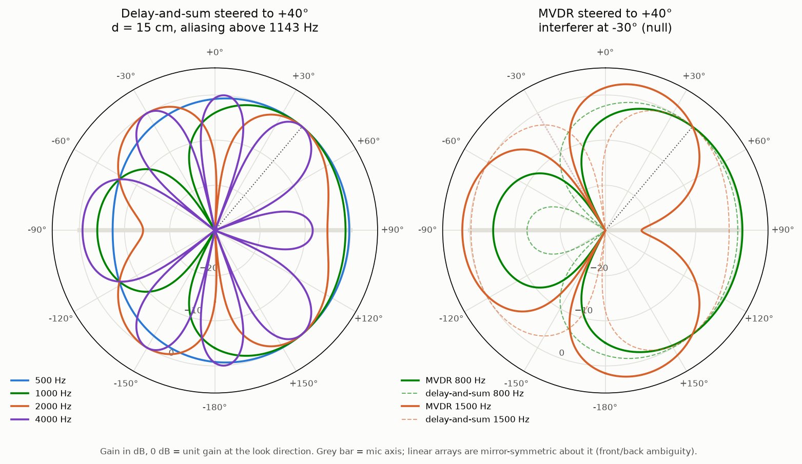

- Beam narrows with frequency; grating lobes above the aliasing limit
  `c/(2d) = 1143 Hz` for `d = 15 cm`; every pattern is mirror-symmetric about
  the mic axis (front/back ambiguity of any linear array).
- MVDR holds 0 dB at +40° and puts a >30 dB null at −30°. With two mics there
  is exactly one null to spend, and the DOA tells you where.
- At 2 kHz the +40° and −30° steering vectors are identical (one full cycle of
  inter-mic delay apart), so no null is possible — a concrete aliasing case.

## 2. PySDR chapter demo — conventional (delay-and-sum) beamformer

`src/pysdr_doa_demo.py` — the chapter's core, end to end.

```python
def steer(theta):                         # steering vector, Nr x 1
    return np.exp(2j*np.pi*d*np.arange(Nr)*np.sin(theta)).reshape(-1, 1)

def conventional_scan(X, theta_scan):     # DOA: output power vs look direction
    return [10*np.log10(np.var(steer(th).conj().T @ X)) for th in theta_scan]

w = steer(theta_look) / Nr                # enhancement: weights for one direction
y = w.conj().T @ X                        # 1 x N beamformer output
```

$$\mathbf{s}(\theta) = \big[1,\; e^{j2\pi d \sin\theta},\; \dots,\; e^{j2\pi (N_{r}-1) d \sin\theta}\big]^T, \qquad \mathbf{w}_{\text{conv}} = \frac{\mathbf{s}(\theta)}{N_{r}}, \qquad P_{\text{conv}}(\theta) = \mathbf{s}^H(\theta) \mathbf{R} \mathbf{s}(\theta)$$

`wᴴ = sᴴ/Nr` conjugates each element's phase lag so the look direction adds
in phase; everything else partially cancels. The scan is that same
operation tried at every angle — a spatial periodogram. Resolution is fixed
by the aperture (`~1/(Nr·d)`), sidelobes by the uniform taper (−13 dB).

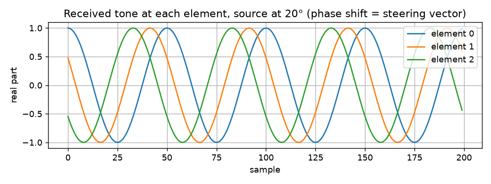

Three elements receive the same tone with a fixed phase offset between them
— that offset *is* the steering vector.

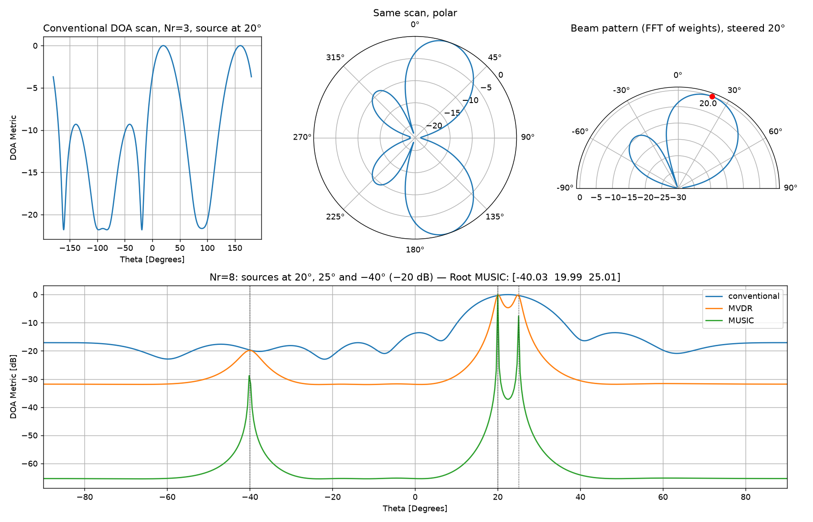

Top: conventional scan (cartesian and polar) for one source at 20°, and the
FFT beam pattern. Bottom: 8 elements, sources at 20°, 25° and −40° (−20 dB).
Conventional merges 20°/25° into one blob; MVDR resolves them; MUSIC gives
needle peaks; Root MUSIC returns `[-40.03, 19.99, 25.01]` in closed form.

Observation on noise: without noise the scan's nulls go to −∞ and the main
lobe is unchanged. Noise only fills the nulls up to the noise floor
(~−22 dB at the chapter's noise level); it doesn't move the peak.

## 3. MVDR vs conventional, one source

`src/pysdr_mvdr.py` — the "MVDR/Capon Beamformer" section as a script.

```python
R = (X @ X.conj().T) / X.shape[1]         # Nr x Nr spatial covariance
Rinv = np.linalg.pinv(R)

def w_mvdr(theta, X):                     # weights for one direction
    s = steer(theta)
    return (Rinv @ s) / (s.conj().T @ Rinv @ s)

def power_mvdr(theta, X):                 # DOA scan, closed form = var(w_mvdrᴴ X)
    s = steer(theta)
    return 1 / (s.conj().T @ Rinv @ s).squeeze()
```

$$\mathbf{w}_{\text{MVDR}} = \arg\min_{\mathbf{w}} \mathbf{w}^H \mathbf{R}  \mathbf{w} \;\;\text{s.t.}\;\; \mathbf{w}^H \mathbf{s}(\theta) = 1 \;\;\Rightarrow\;\; \mathbf{w}_{\text{MVDR}} = \frac{\mathbf{R}^{-1}\mathbf{s}}{\mathbf{s}^H \mathbf{R}^{-1} \mathbf{s}}, \qquad P_{\text{MVDR}}(\theta) = \frac{1}{\mathbf{s}^H \mathbf{R}^{-1} \mathbf{s}}$$

Minimize output power `wᴴRw` subject to `wᴴs = 1`. `R⁻¹` de-emphasizes
whatever is strong in the data that isn't at θ, so interferers get nulled
without being named. The scan value is the denominator of `w`; the
enhancement weights are the numerator kept — one `R⁻¹` serves both.

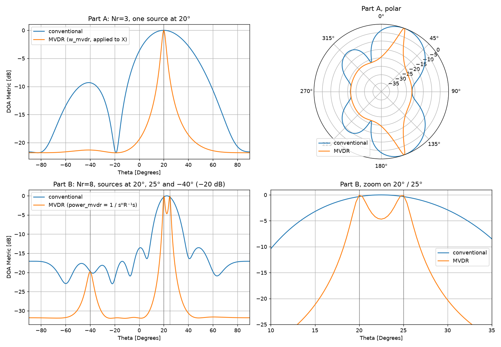

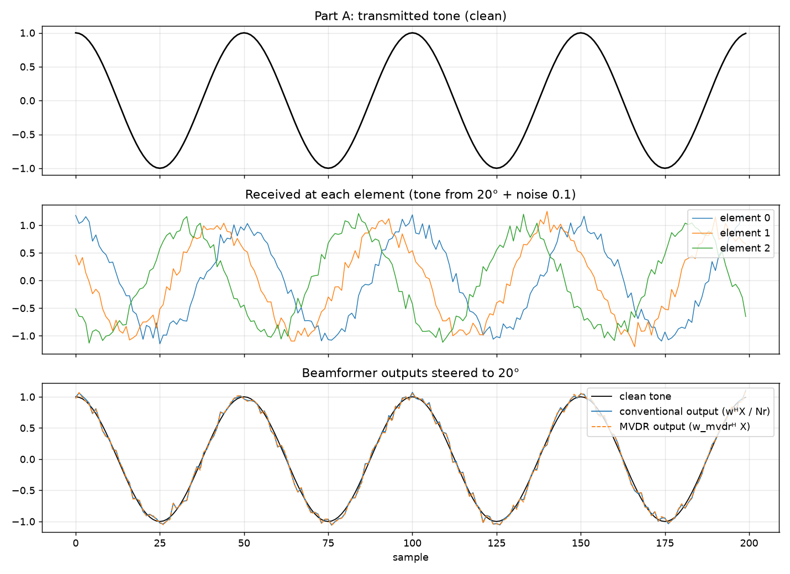

Weights for Part A (3 elements, source at 20°):

```
w_conv = [ 0.3333+0.0000j   0.1587+0.2931j  -0.1822+0.2792j ]   |w| = 0.333 each, phase 0 / 61.6° / 123.1°
w_mvdr = [ 0.2413-0.0372j   0.1471+0.3185j  -0.2358+0.3341j ]   |w| = 0.244 / 0.351 / 0.409
```

SNR: element 17.0 dB → conventional 21.8 dB → MVDR 21.6 dB. With a single
source in white noise MVDR has nothing to null and collapses to
delay-and-sum; both get the `10·log10(3) = 4.8 dB` array gain. MVDR's
magnitude tilt is finite-sample noise fitting (it costs 0.2 dB), which is
what diagonal loading fixes. MVDR's advantage is in the *scan* (sharper
peak), not in this output.

## 4. Two sources: the null appears

`src/pysdr_mvdr_two_sources.py` — target at +20°, equal-power interferer at
−40°, 3 elements.

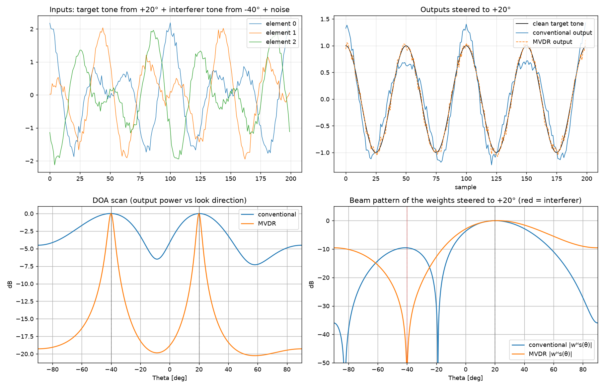

```
                 gain @ +20°     gain @ −40°     output SNR
element 0                                         −0.1 dB
conventional     1.000 (0 dB)    0.333 (−9.6 dB)   9.3 dB
MVDR             1.000 (0 dB)    0.003 (−51.8 dB) 21.1 dB
```

Now the weights differ for a reason: MVDR reshapes magnitudes to
0.17 / 0.50 / 0.33 so that `wᴴs(−40°) ≈ 0`. Conventional can't; the
interferer sits on a −9.6 dB sidelobe and visibly distorts the output.

## 5. Part B: detect three sources, then extract them

`src/pysdr_mvdr_part_b.py` — 8 elements, sources at +20°, +25° (equal) and
−40° (−20 dB). The chapter's stated goal is **detection**: three peaks a
peak-finder can extract.

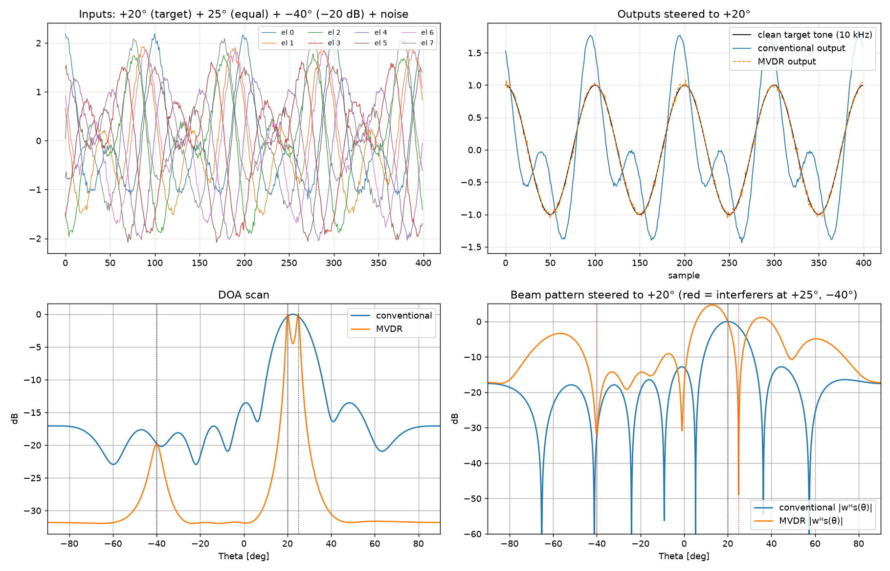

`scipy.signal.find_peaks(prominence=3 dB)` on the two scans:

| | peaks found |
|---|---|
| conventional | 22.5° (merged blob) + two sidelobes at −47°, −14° — the −40° source is not a peak |
| MVDR | **20.1°, 24.9°, −39.9°** — all three, within 0.1° |

Steered to +20° for extraction, MVDR nulls the +25° source at −58 dB (5°
off-look, inside the conventional beamwidth) and the output SNR goes from
1.5 dB to 26.2 dB. The price: MVDR's sidelobes elsewhere are *higher* than
conventional's — it minimizes power for this `R`, not sidelobes in general.

### Extracting all three at once

`src/pysdr_extract_three.py` — one weight vector per detected peak,
`Y = Wᴴ X` gives a 3 × N matrix of separated streams.

```python
C = np.hstack([steer(th) for th in doas])                        # Nr x K
W_mvdr = np.hstack([(Rinv @ steer(th)) / (steer(th).conj().T @ Rinv @ steer(th)) for th in doas])
W_lcmv = Rinv @ C @ np.linalg.inv(C.conj().T @ Rinv @ C)         # Cᴴ W = I
W_zf   = C @ np.linalg.inv(C.conj().T @ C)                       # pinv(C)ᴴ
Y = W.conj().T @ X                                               # K x N, one row per source
```

$$\mathbf{C} = [\mathbf{s}_{1} \cdots \mathbf{s}_{K}], \qquad \mathbf{W}_{\text{bank}} = \Big[\tfrac{\mathbf{R}^{-1}\mathbf{s}_{k}}{\mathbf{s}_{k}^H \mathbf{R}^{-1} \mathbf{s}_{k}}\Big]_{k=1..K}, \qquad \mathbf{W}_{\text{LCMV}} = \mathbf{R}^{-1}\mathbf{C} (\mathbf{C}^H \mathbf{R}^{-1} \mathbf{C})^{-1}, \qquad \mathbf{W}_{\text{ZF}} = \mathbf{C} (\mathbf{C}^H \mathbf{C})^{-1}, \qquad \mathbf{Y} = \mathbf{W}^H \mathbf{X}$$

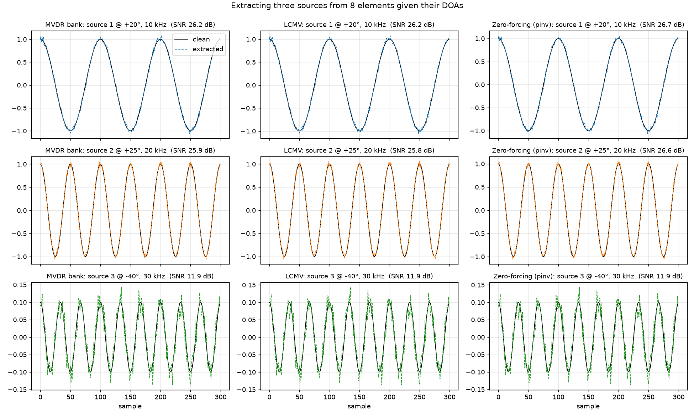

```
                 +20°    +25°    −40°     (output SNR, dB; inputs were −0.1 / −0.1 / −23)
MVDR bank        26.2    25.9    11.9
LCMV             26.2    25.8    11.9
Zero-forcing     26.7    26.6    11.9
```

*MVDR bank* = `w_mvdr()` called once per peak; each beam nulls the other two
implicitly because they're in `R`. *LCMV* makes those nulls explicit with
`C = [s₁ s₂ s₃]`, `f = e_k`. *Zero-forcing* uses only geometry — fine in white
noise, loses to the adaptive methods once noise is directional or reverberant.

## 6. LCMV

`src/pysdr_lcmv.py` — the "LCMV Beamformer" section.

```python
C = np.concatenate([steer(th) for th in constraint_angles], axis=1)   # Nr x K
f = np.array([1]*n_pass + [0]*n_null).reshape(-1, 1)                  # desired gain per constraint
w = Rinv @ C @ np.linalg.pinv(C.conj().T @ Rinv @ C) @ f              # Nr x 1
```

$$\mathbf{w}_{\text{LCMV}} = \arg\min_{\mathbf{w}} \mathbf{w}^H \mathbf{R}  \mathbf{w} \;\;\text{s.t.}\;\; \mathbf{C}^H \mathbf{w} = \mathbf{f} \;\;\Rightarrow\;\; \mathbf{w}_{\text{LCMV}} = \mathbf{R}^{-1}\mathbf{C} (\mathbf{C}^H \mathbf{R}^{-1} \mathbf{C})^{-1}\mathbf{f}$$

Minimize `wᴴRw` subject to `Cᴴw = f`: K linear constraints (unit gain here,
zero there) enforced exactly, and the remaining `Nr−K` degrees of freedom
spent by `R⁻¹` on minimizing everything else. MVDR is the `K=1, f=1` case.

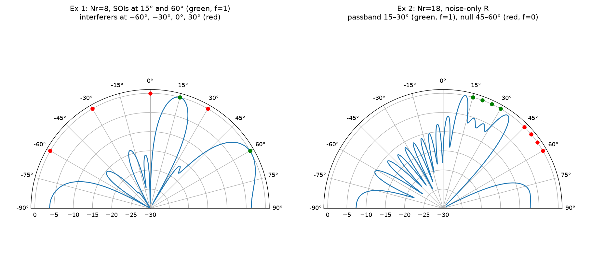

- Ex 1: 8 elements, four interferers at −60°/−30°/0°/30°, two look directions
  at 15° and 60° (`f = [1, 1]`). Both constraints hold at exactly 1.0; the
  interferers land at −39 to −46 dB without being named — `R` does it.
- Ex 2: 18 elements, noise-only `R`, four unit-gain constraints across 15–30°
  and four zeros across 45–60°: a wide passband and stopband from one `w`,
  at the cost of 8 of 18 degrees of freedom.

MVDR is LCMV with one constraint; the three-source extractor is LCMV with
three.

## 7. MUSIC: subspace DOA

`src/pysdr_music.py` — the "MUSIC" section, plus Root MUSIC. Same
three-source scenario as Part B.

```python
R = np.cov(X)
w, v = np.linalg.eig(R)
v = v[:, np.argsort(np.abs(w))]           # eigenvectors sorted by eigenvalue, ascending
V = v[:, :Nr - K]                         # noise subspace: the Nr-K smallest

def music_metric(theta):                  # DOA scan
    s = steer(theta)
    return 1 / np.abs(s.conj().T @ V @ V.conj().T @ s).squeeze()

# Root MUSIC: same V, solve a polynomial instead of scanning
D = V @ V.conj().T
p = [np.sum(np.diag(D, k - (Nr-1))) for k in range(2*Nr - 1)]
roots = np.roots(p[::-1]); roots = roots[np.abs(roots) <= 1]
roots = roots[np.argsort(-np.abs(roots))][:K]
doas = np.arcsin(np.angle(roots) / (2*np.pi*d))
```

$$\mathbf{R} = \mathbf{U}\boldsymbol{\Lambda}\mathbf{U}^H = \underbrace{\mathbf{U}_{s} \boldsymbol{\Lambda}_{s} \mathbf{U}_{s}^H}_{K \text{ signal}} + \underbrace{\mathbf{V}  \sigma^2 \mathbf{V}^H}_{N_{r} - K \text{ noise}}, \qquad P_{\text{MUSIC}}(\theta) = \frac{1}{\mathbf{s}^H(\theta) \mathbf{V}\mathbf{V}^H \mathbf{s}(\theta)}$$

`R` has `K` large eigenvalues (signal subspace) and `Nr−K` small ones equal
to the noise power. A true steering vector lies in the signal subspace, so
its projection onto `V` is ~0 and `1/(sᴴVVᴴs)` spikes. The metric measures
*orthogonality*, not power, so peak height says nothing about source level.
`K` is an input; the eigenvalue plot is how you choose it.

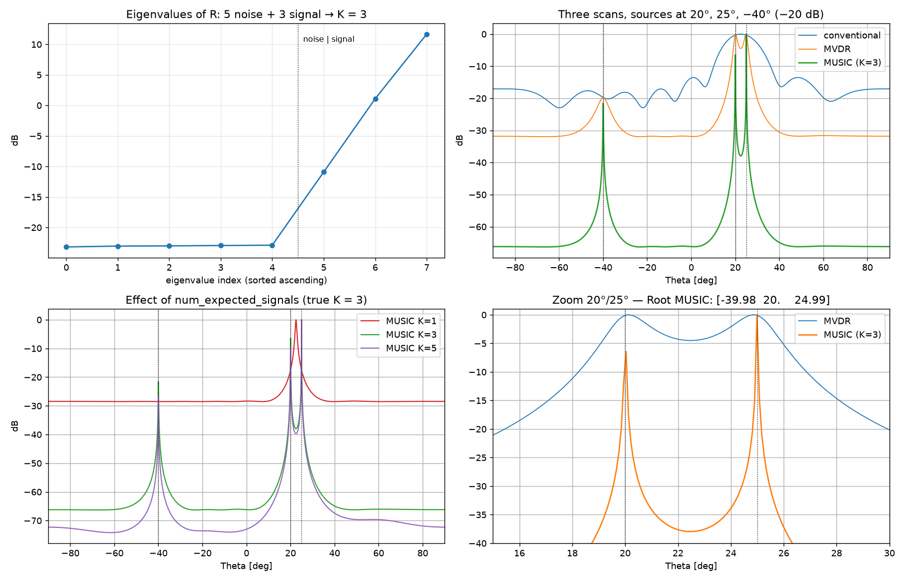

```
eigenvalues of R:  0.005 ×5  |  0.081  1.288  14.729     → K = 3
peaks:   conventional  [-47.0, -13.8, 22.5]   (one blob + two sidelobes)
         MVDR          [-39.9,  20.1, 24.9]
         MUSIC K=3     [-40.0,  20.0, 25.0]
Root MUSIC K=3         [-39.98, 20.00, 24.99]
```

- The −20 dB source at −40° gets the same ~60 dB needle as the strong ones —
  orthogonality, not power.
- `K=1` (too few): the noise subspace still contains two signals; 20°/25°
  blur into 22.5° and −40° drops 20 dB. `K=5` (too many): real peaks survive
  but spurious ones appear (Root MUSIC invents −17° and 64°).
- Acoustic caveats: needs `K < Nr` (two mics → one source), narrowband per
  bin, and *uncorrelated* sources — reverberant copies are correlated and
  degrade the subspace split, which is why GCC-PHAT/SRP tends to win in rooms
  and MUSIC in RF.

## 8. LMS: known waveform, unknown direction

`src/pysdr_lms.py` — the "LMS" section. 8 elements, SOI = repeated Gold-code
pilot from 20°, two equal-power tone jammers from 60° and −50°, noise 0.5.
LMS is given the pilot but **not** the DOA, and adapts one sample at a time.

```python
w = np.zeros((Nr, 1), dtype=complex)
for i in range(N):
    r_i = r[:, i].reshape(-1, 1)          # one snapshot, Nr x 1
    y = (w.conj().T @ r_i).squeeze()      # current output
    e = soi[i] - y                        # error against the known pilot
    w += mu * np.conj(e) * r_i            # stochastic gradient step
```

$$\mathbf{w}_{n+1} = \mathbf{w}_{n} + \mu  \underbrace{\big(y_{n} - \mathbf{w}_{n}^H \mathbf{x}_{n}\big)^{*}}_{\text{error}}  \mathbf{x}_{n} \;\;\xrightarrow{\;n\to\infty\;}\;\; \mathbf{w}_{\text{Wiener}} = \mathbf{R}^{-1}\mathbf{p}, \quad \mathbf{p} = E[\mathbf{x}  y^{*}]$$

Stochastic gradient descent on `E|soi − wᴴr|²`. No covariance, no matrix
inverse, O(Nr) per sample; converges to the Wiener solution `R⁻¹p` with
`p = E[r·soi*]`, which for a pilot from θ is proportional to `R⁻¹s(θ)` —
the MVDR direction.

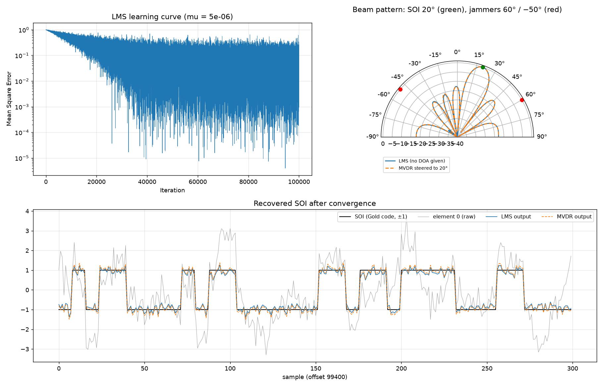

```
                 gain @20° (SOI)   @60° jammer   @−50° jammer   SNR (last 20k samples)
element 0                                                          −4.0 dB
LMS              0.925 (−0.7 dB)   −55.3 dB      −37.2 dB          12.3 dB
MVDR (DOA=20°)   1.000 ( 0.0 dB)   −53.3 dB      −42.9 dB          12.0 dB
```

- LMS lands on the MVDR weights (normalized vectors agree to ~0.01); the
  beam patterns coincide — main lobe on 20°, nulls on both jammers, none of
  which LMS was told. The LMS fixed point is the Wiener solution `R⁻¹p`, and
  with a pilot `p = E[r·soi*] ∝ s(20°)`.
- ~40k samples to converge at `μ = 5e-6`; larger `μ` is faster but noisier
  (stability bound ≈ `2/trace(R)`).
- Acoustic analogue: NLMS with a reference signal is the adaptive stage of a
  GSC and of echo cancellation — no pilot for speech, but a known reference
  for loudspeaker playback or motor/ego-noise on a robot.

## 9. Circular arrays (UCA)

`src/pysdr_uca.py` — the "Circular Arrays" section. The page gives only the
UCA steering vector and says everything else carries over, scanned 0–360°.
5-element UCA (KrakenSDR layout), sources at 30° and 150°, next to a
5-element ULA on the same scene.

```python
x = radius * np.cos(2*np.pi/Nr * np.arange(Nr))      # element positions in wavelengths
y = -radius * np.sin(2*np.pi/Nr * np.arange(Nr))     # (the page's d*sf product equals radius)

def steer_uca(theta):                                # theta from +x, counter-clockwise
    return np.exp(1j*2*np.pi*(x*np.cos(theta) + y*np.sin(theta))).reshape(-1, 1)

theta_scan = np.linspace(0, 2*np.pi, 1441)           # full circle, not -90..90
```

$$\mathbf{s}_{k}(\theta) = \exp\big(j 2\pi\,(x_{k}\cos\theta + y_{k}\sin\theta)\big), \qquad x_{k} = r\cos\tfrac{2\pi k}{N_{r}}, \quad y_{k} = -r\sin\tfrac{2\pi k}{N_{r}}$$

The steering vector is just the plane-wave phase at each element position
— the ULA's `k·d·sinθ` is the special case of elements on a line. Every
scan/beamformer above works unchanged; only `steer()` and the scan range
differ.

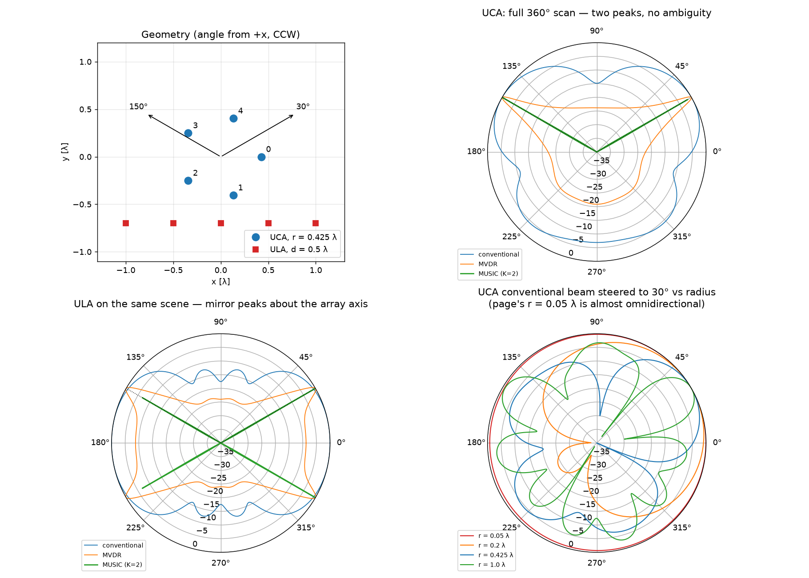

```
UCA r = 0.425 λ (adjacent spacing 0.5 λ), sources at 30°, 150°
  UCA  MVDR / MUSIC peaks:  [30.0, 150.0]                 (conventional adds a spurious lobe at 226°)
  ULA  MVDR / MUSIC peaks:  [30.0, 150.0, 210.0, 330.0]   (mirror images about the array axis)
```

- The UCA resolves the full circle with no ambiguity; the ULA reports each
  source twice (`θ` and `−θ`) because a line array only measures `cosθ`.
- Radius sweep (bottom-right): the page's `r = 0.05 λ` is almost a point —
  the conventional beam is nearly omnidirectional. `r ≈ 0.4 λ` gives a
  usable beam; `r = 1 λ` is sharper but grows grating-like lobes.
- Acoustic: this is the ReSpeaker / Echo ring layout. Same trade-off as §1:
  ring radius sets the aliasing frequency; per-bin steering handles the
  broadband part.

## Takeaways for the microphone array

1. The DOA estimate is only half the job; the same `R⁻¹` that produced the
   scan gives the enhancement weights for free (`scan = 1/(sᴴR⁻¹s)` is the
   denominator of `w`).
2. Delay-and-sum against spatially white noise buys only `10·log10(M)` dB.
   The big wins come from nulling *directional* interference (MVDR/LCMV) and
   from a Wiener postfilter on top (`src/wiener.py` is exactly MVDR + Wiener).
3. With `M` mics you get `M−1` nulls; two mics → one null. Spend it on the
   loudest interferer.
4. Keep `d < λ/2` at the highest frequency you care about, or accept that
   some angle pairs become indistinguishable (the 2 kHz case above).
5. Acoustic signals are broadband: do everything per STFT bin with
   `s_k(f) = exp(2jπ f τ_k)`, then ISTFT.
6. Two ways to get the weights: know the *direction* (MVDR/LCMV, needs
   `R⁻¹`) or know the *waveform* (LMS, needs a reference). They converge to
   the same answer; pick by which side information you actually have.
7. For DOA alone, MUSIC gives the sharpest peaks but needs `K` and
   uncorrelated sources; MVDR's scan is a safer default in rooms, and its
   `R⁻¹` is reused for enhancement.
8. Geometry enters only through `steer()`. A ring (UCA) removes the
   front/back ambiguity a 2-mic or linear array has; nothing else in the
   pipeline changes.
